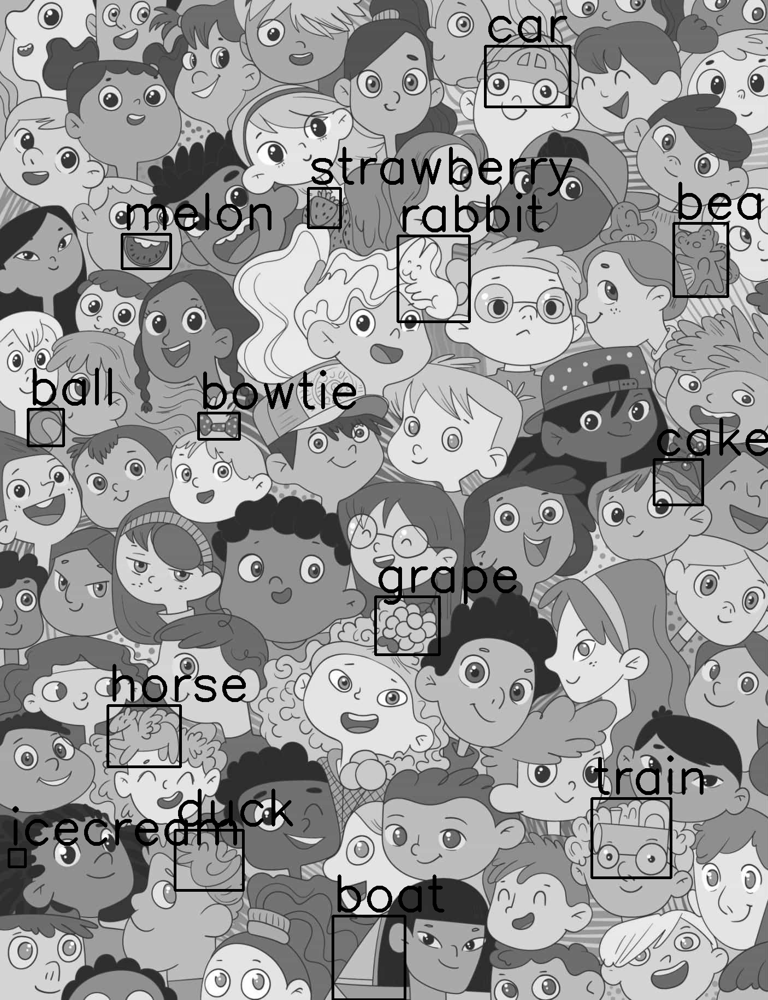

# Template Matching exercise
This exercise demonstrates the use of template matching techniques to find and count objects in images.

<div align="center">
  
</div>

## Usage
1. Install the required packages:
    ```sh
    pip install -r requirements.txt
    ```

2. Run the Jupyter notebook.